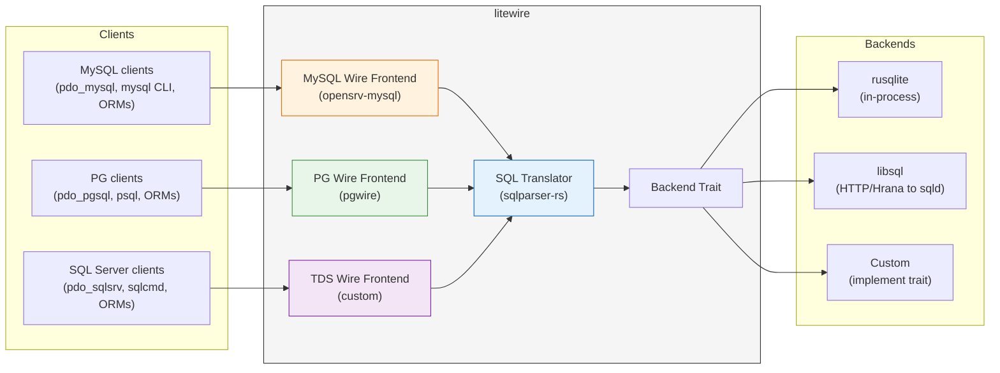
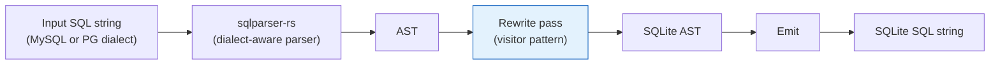
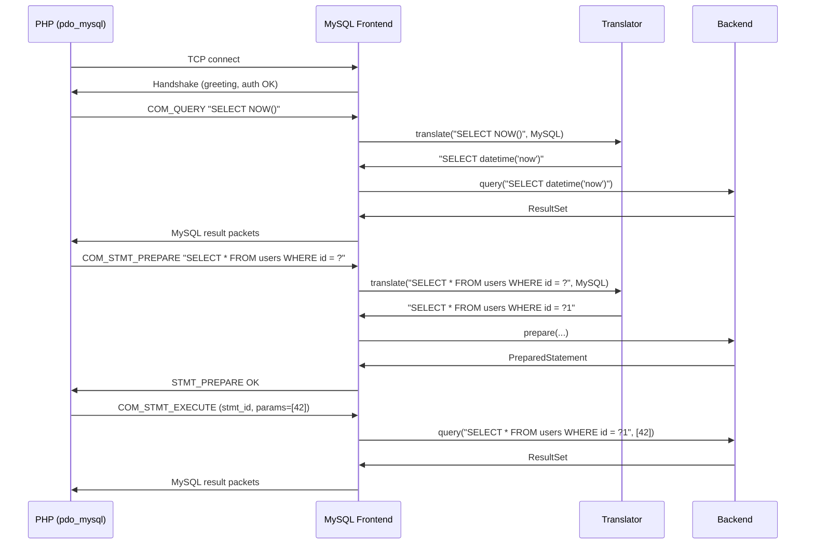
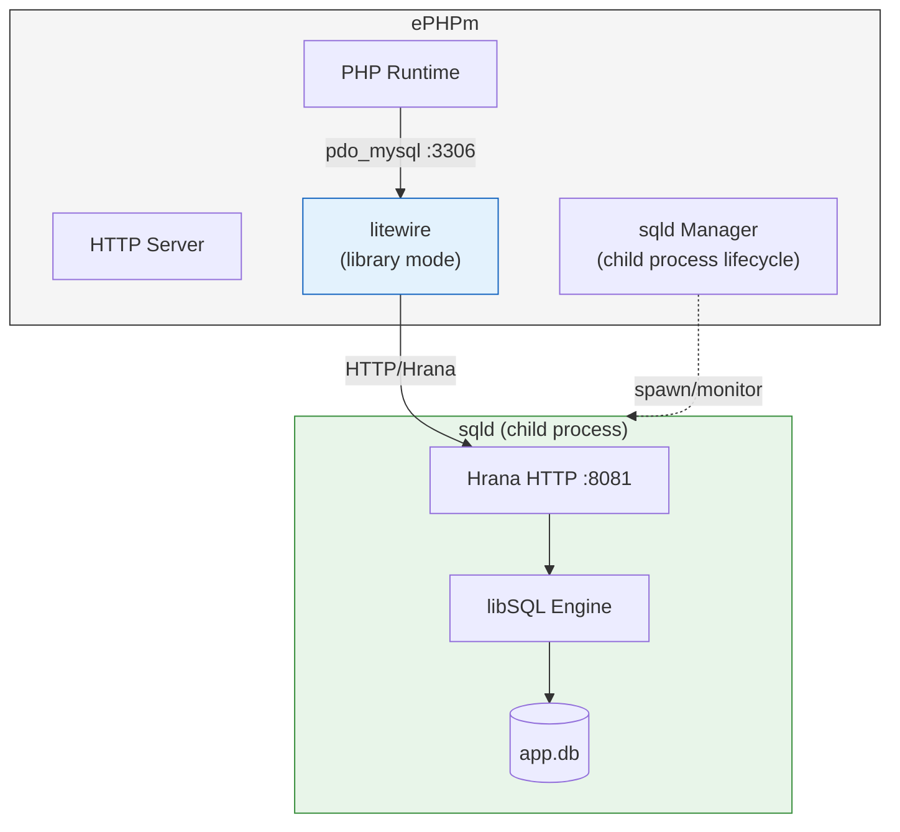

# litewire Architecture

litewire is a protocol translation proxy: it accepts MySQL and PostgreSQL wire protocol connections, translates the SQL dialect to SQLite, executes against a pluggable backend, and returns results in the original wire format.

## Overview



## Crate Structure

```
litewire/
├── Cargo.toml              # workspace root
├── crates/
│   ├── litewire/           # main crate (re-exports everything)
│   │   ├── src/
│   │   │   ├── lib.rs      # public API: LiteWire builder
│   │   │   └── main.rs     # CLI binary
│   │   └── Cargo.toml
│   ├── litewire-translate/ # SQL dialect translation
│   │   ├── src/
│   │   │   ├── lib.rs
│   │   │   ├── mysql.rs    # MySQL -> SQLite rewrites
│   │   │   ├── postgres.rs # PG -> SQLite rewrites
│   │   │   ├── tds.rs      # T-SQL -> SQLite rewrites
│   │   │   ├── common.rs   # shared rewrites (types, functions)
│   │   │   ├── metadata.rs # SHOW/DESCRIBE/INFORMATION_SCHEMA/sys.*
│   │   │   └── emit.rs     # AST -> SQLite SQL string
│   │   └── Cargo.toml
│   ├── litewire-mysql/     # MySQL wire protocol frontend
│   │   ├── src/
│   │   │   ├── lib.rs
│   │   │   ├── handler.rs  # opensrv-mysql shim implementation
│   │   │   ├── types.rs    # MySQL type <-> SQLite affinity mapping
│   │   │   └── resultset.rs# SQLite rows -> MySQL wire result packets
│   │   └── Cargo.toml
│   ├── litewire-postgres/  # PG wire protocol frontend
│   │   ├── src/
│   │   │   ├── lib.rs
│   │   │   ├── handler.rs  # pgwire processor implementation
│   │   │   ├── types.rs    # PG OID <-> SQLite affinity mapping
│   │   │   └── resultset.rs# SQLite rows -> PG wire result packets
│   │   └── Cargo.toml
│   ├── litewire-tds/       # TDS (SQL Server) wire protocol frontend
│   │   ├── src/
│   │   │   ├── lib.rs
│   │   │   ├── handler.rs  # TDS protocol handler (custom implementation)
│   │   │   ├── types.rs    # SQL Server type <-> SQLite affinity mapping
│   │   │   └── resultset.rs# SQLite rows -> TDS result tokens
│   │   └── Cargo.toml
│   └── litewire-backend/   # backend trait + implementations
│       ├── src/
│       │   ├── lib.rs      # Backend trait definition
│       │   ├── rusqlite.rs # rusqlite backend
│       │   └── libsql.rs   # libsql HTTP/Hrana backend
│       └── Cargo.toml
├── tests/
│   ├── mysql_compat.rs     # MySQL client -> litewire -> SQLite roundtrip
│   ├── pg_compat.rs        # PG client -> litewire -> SQLite roundtrip
│   ├── tds_compat.rs       # SQL Server client -> litewire -> SQLite roundtrip
│   ├── wordpress.rs        # WordPress SQL patterns
│   └── laravel.rs          # Laravel SQL patterns
└── docs/
    ├── architecture.md     # this file
    └── sql-translation.md  # full translation reference
```

## Component Design

### Backend Trait

The backend trait abstracts over how SQL gets executed. litewire doesn't care whether SQLite is in-process or remote.

```rust
#[async_trait]
pub trait Backend: Send + Sync + 'static {
    /// Execute a query and return rows.
    async fn query(&self, sql: &str, params: &[Value]) -> Result<ResultSet>;

    /// Execute a statement and return affected row count.
    async fn execute(&self, sql: &str, params: &[Value]) -> Result<ExecuteResult>;

    /// Prepare a statement (optional, default falls back to query/execute).
    async fn prepare(&self, sql: &str) -> Result<PreparedStatement> { ... }
}
```

The `rusqlite` backend wraps queries in `spawn_blocking`. The `libsql` backend sends HTTP requests to sqld's Hrana API. Custom backends implement the trait for whatever storage they need.

### SQL Translator

The translator is the core of litewire. It uses `sqlparser-rs` to parse input SQL into an AST, rewrites dialect-specific nodes, then emits SQLite-compatible SQL.



The rewrite pass is a visitor pattern over the AST:

```rust
pub fn translate(sql: &str, source_dialect: Dialect) -> Result<String> {
    let ast = Parser::parse_sql(&source_dialect, sql)?;
    let rewritten = rewrite_statements(ast)?;
    Ok(emit_sqlite(&rewritten))
}
```

Rewrite rules are organized by category:

**Expressions** (`common.rs`):
- `NOW()` -> `datetime('now')`
- `CURDATE()` -> `date('now')`
- `UNIX_TIMESTAMP()` -> `strftime('%s', 'now')`
- `TRUE` / `FALSE` -> `1` / `0`
- `IFNULL()` -> passed through (SQLite supports it)
- `::type` casts -> `CAST(... AS ...)`
- `$1`, `$2` params -> `?1`, `?2`

**DDL** (`mysql.rs` / `postgres.rs`):
- `AUTO_INCREMENT` -> `AUTOINCREMENT` (on `INTEGER PRIMARY KEY`)
- `SERIAL` / `BIGSERIAL` -> `INTEGER PRIMARY KEY AUTOINCREMENT`
- `VARCHAR(n)`, `CHAR(n)` -> `TEXT`
- `INT`, `BIGINT`, `SMALLINT`, `TINYINT` -> `INTEGER`
- `FLOAT`, `DOUBLE`, `DECIMAL` -> `REAL`
- `BLOB`, `LONGBLOB`, `BYTEA` -> `BLOB`
- `BOOLEAN` -> `INTEGER`
- `DATETIME`, `TIMESTAMP` -> `TEXT`
- `ENGINE=InnoDB` -> stripped
- `DEFAULT CHARSET=...` -> stripped

**DML** (`mysql.rs`):
- `INSERT ... ON DUPLICATE KEY UPDATE` -> `INSERT ... ON CONFLICT DO UPDATE`
- `REPLACE INTO` -> passed through (SQLite supports it)
- `LIMIT x, y` -> `LIMIT y OFFSET x`

**Metadata** (`metadata.rs`):
- `SHOW TABLES` -> `SELECT name FROM sqlite_master WHERE type='table' ORDER BY name`
- `SHOW DATABASES` -> synthetic single-row result
- `SHOW COLUMNS FROM t` / `DESCRIBE t` -> `PRAGMA table_info(t)`
- `SHOW CREATE TABLE t` -> reconstruct from `sqlite_master`
- `SHOW INDEX FROM t` -> `PRAGMA index_list(t)` + `PRAGMA index_info(...)`
- `SELECT ... FROM INFORMATION_SCHEMA.TABLES` -> `sqlite_master` query
- `SELECT ... FROM INFORMATION_SCHEMA.COLUMNS` -> `PRAGMA table_info` for each table
- `SELECT ... FROM pg_catalog.*` -> mapped to equivalent PRAGMAs

**No-ops** (swallowed silently):
- `SET NAMES ...`
- `SET CHARACTER SET ...`
- `SET SESSION ...` / `SET GLOBAL ...` (most)
- `SET time_zone = ...`
- `SET sql_mode = ...`

### MySQL Wire Frontend

Built on `opensrv-mysql` (Databend's production MySQL protocol crate). Implements the `AsyncMysqlShim` trait:



Key implementation details:
- **Auth**: accepts any username/password (or configurable via callback)
- **COM_QUERY**: simple text query protocol. Parse MySQL SQL, translate, execute, return results.
- **COM_STMT_PREPARE / COM_STMT_EXECUTE**: prepared statement protocol. Required for `pdo_mysql` which uses prepared statements by default.
- **COM_INIT_DB**: "USE database" -- no-op (SQLite has one database)
- **COM_PING**: health check -- always OK
- **COM_FIELD_LIST**: column metadata -- backed by PRAGMA

### PostgreSQL Wire Frontend

Built on `pgwire` crate. Implements the `SimpleQueryHandler` and `ExtendedQueryHandler` traits:

- **Simple query protocol**: `Query` message -> translate PG SQL -> execute -> `RowDescription` + `DataRow` + `CommandComplete`
- **Extended query protocol**: `Parse`/`Bind`/`Describe`/`Execute`/`Sync` -- required for `pdo_pgsql`
- **Type OIDs**: SQLite affinities mapped to PG type OIDs in `RowDescription` messages so drivers handle types correctly

### TDS (SQL Server) Wire Frontend

The TDS (Tabular Data Stream) protocol is used by SQL Server and Sybase. No Rust crate exists for the server side of TDS -- `tiberius` implements only the client. The litewire TDS frontend is a custom implementation of the TDS 7.x protocol.

TDS is a token-based binary protocol. Key message types:

- **Pre-Login**: TLS negotiation and version exchange
- **Login7**: authentication (SQL auth or NTLM)
- **SQL Batch**: text query (equivalent to MySQL's `COM_QUERY`)
- **RPC Request**: parameterized query / stored procedure call (equivalent to prepared statements)
- **Response tokens**: `COLMETADATA` + `ROW` + `DONE` (equivalent to MySQL result set packets)

T-SQL-specific translation rules (in addition to the shared rules):

| T-SQL | SQLite |
|-------|--------|
| `GETDATE()` | `datetime('now')` |
| `GETUTCDATE()` | `datetime('now')` |
| `NEWID()` | `lower(hex(randomblob(16)))` |
| `ISNULL(a, b)` | `IFNULL(a, b)` |
| `TOP n` | `LIMIT n` |
| `IDENTITY(1,1)` | `INTEGER PRIMARY KEY AUTOINCREMENT` |
| `NVARCHAR(n)` / `NCHAR(n)` | `TEXT` |
| `BIT` | `INTEGER` |
| `MONEY` / `SMALLMONEY` | `REAL` |
| `UNIQUEIDENTIFIER` | `TEXT` |
| `@@IDENTITY` | `last_insert_rowid()` |
| `@@ROWCOUNT` | `changes()` |
| `sys.tables` / `sys.columns` | `sqlite_master` + `PRAGMA` queries |
| `sp_tables` / `sp_columns` | mapped to `sqlite_master` + `PRAGMA` |
| `SET NOCOUNT ON` | no-op |
| `BEGIN TRY ... END TRY` | stripped (SQLite has no structured error handling) |
| `[bracketed identifiers]` | `"quoted identifiers"` |

Key implementation details:
- **Auth**: accept any SQL auth credentials (or configurable callback). NTLM/Kerberos not supported.
- **SQL Batch**: parse T-SQL, translate, execute, return `COLMETADATA` + `ROW` + `DONE` tokens.
- **RPC Request**: handle `sp_executesql` (parameterized queries) and `sp_prepare`/`sp_execute`.
- **`USE database`**: no-op (SQLite has one database).
- **TDS version**: target TDS 7.4 (SQL Server 2012+). Older versions are out of scope.

PHP connects via `pdo_sqlsrv` or `pdo_dblib`. Laravel's `sqlsrv` driver works out of the box:

```php
// Laravel .env
DB_CONNECTION=sqlsrv
DB_HOST=127.0.0.1
DB_PORT=1433
DB_DATABASE=app
```

### Result Set Mapping

SQLite returns untyped text values. The wire protocol frontends must map them to typed values:

| SQLite affinity | MySQL type | PG type | TDS type |
|----------------|------------|---------|----------|
| `INTEGER` | `MYSQL_TYPE_LONGLONG` | `INT8` (OID 20) | `BIGINTTYPE` |
| `REAL` | `MYSQL_TYPE_DOUBLE` | `FLOAT8` (OID 701) | `FLT8TYPE` |
| `TEXT` | `MYSQL_TYPE_VAR_STRING` | `TEXT` (OID 25) | `NVARCHARTYPE` |
| `BLOB` | `MYSQL_TYPE_BLOB` | `BYTEA` (OID 17) | `IMAGETYPE` |
| `NULL` | `MYSQL_TYPE_NULL` | null indicator | null flag in `ROW` token |

Column type hints come from `decltype` in the SQLite result metadata (e.g., if the column was declared `INTEGER`, use integer type even if the value is text).

## Dependencies

```toml
# Wire protocol
opensrv-mysql = "0.8"                    # MySQL server protocol
pgwire = "0.28"                          # PG server protocol
# TDS: no server-side crate exists -- custom implementation using tokio bytes/codec

# SQL parsing and translation
sqlparser = { version = "0.57", features = ["serde"] }

# Backends (feature-gated)
rusqlite = { version = "0.32", optional = true, features = ["bundled"] }
libsql = { version = "0.7", optional = true, features = ["remote"] }

# Async runtime
tokio = { version = "1", features = ["full"] }
bytes = "1"                              # TDS packet framing
tokio-util = { version = "0.7", features = ["codec"] }  # TDS codec

# Error handling
thiserror = "2"
anyhow = "1"

# Logging
tracing = "0.1"
```

## Feature Flags

| Flag | Default | What it enables |
|------|---------|----------------|
| `mysql` | yes | MySQL wire protocol frontend |
| `postgres` | yes | PostgreSQL wire protocol frontend |
| `tds` | yes | TDS (SQL Server) wire protocol frontend |
| `backend-rusqlite` | yes | In-process SQLite via rusqlite |
| `backend-libsql` | no | Remote sqld via HTTP/Hrana |
| `cli` | no | `litewire` binary (pulls in clap) |

## Implementation Phases

### Phase 1: MySQL wire + passthrough
- `opensrv-mysql` accepts connections
- No SQL translation -- forward raw SQL to rusqlite
- Validates wire protocol plumbing end-to-end
- Test: `mysql -h 127.0.0.1 -e "SELECT 1"` works

### Phase 2: SQL translator core
- `sqlparser-rs` parses MySQL dialect
- Rewrite expressions: `NOW()`, `TRUE/FALSE`, type casts
- Rewrite DML: `ON DUPLICATE KEY UPDATE`, `LIMIT offset, count`
- Emit SQLite SQL from rewritten AST
- Test: basic INSERT/SELECT/UPDATE/DELETE with MySQL syntax

### Phase 3: DDL translation
- `CREATE TABLE` with MySQL types -> SQLite affinities
- `ALTER TABLE` (limited -- SQLite's ALTER is restricted)
- `AUTO_INCREMENT` -> `AUTOINCREMENT`
- Strip MySQL-specific clauses (`ENGINE=`, `CHARSET=`, etc.)
- Test: `php artisan migrate` completes

### Phase 4: Metadata queries
- `SHOW TABLES`, `SHOW COLUMNS`, `DESCRIBE` -> `sqlite_master` / `PRAGMA`
- `INFORMATION_SCHEMA.TABLES` / `COLUMNS` -> synthetic results
- `SHOW CREATE TABLE` -> reconstructed DDL
- Test: `php artisan migrate:status` works, Doctrine schema introspection passes

### Phase 5: Prepared statements
- `COM_STMT_PREPARE` / `COM_STMT_EXECUTE` for MySQL
- Parameter binding: MySQL `?` -> SQLite `?` (positional, same)
- Required for `pdo_mysql` which uses prepared statements by default
- Test: Laravel ORM CRUD operations

### Phase 6: PostgreSQL wire frontend
- `pgwire` simple query + extended query protocol
- PG-specific rewrites: `$1`->`?1`, `SERIAL`, `::type` casts
- Shares the same translator core as MySQL
- Test: `psql` connects, Laravel with `pdo_pgsql` works

### Phase 7: TDS (SQL Server) wire frontend
- Custom TDS 7.4 protocol implementation (Pre-Login, Login7, SQL Batch, RPC Request)
- T-SQL-specific rewrites: `GETDATE()`, `TOP n`, `ISNULL()`, `IDENTITY`, `[brackets]`
- `sys.tables` / `sys.columns` / `sp_tables` / `sp_columns` -> `sqlite_master` + `PRAGMA`
- `sp_executesql` handling for parameterized queries
- Test: `sqlcmd` connects, Laravel with `pdo_sqlsrv` works

### Phase 8: libsql backend
- `Backend` implementation using `libsql` crate with `remote` feature
- Connects to sqld via HTTP/Hrana
- Test: litewire -> sqld -> SQLite roundtrip

### Phase 9: WordPress + Laravel test suites
- Run WordPress test suite through litewire (MySQL frontend)
- Run Laravel test suite through litewire (MySQL, PG, and SQL Server frontends)
- Document unsupported SQL constructs per dialect
- Fix translation gaps discovered by real-world usage

## Prior Art

| Project | Language | What it does | Status |
|---------|----------|-------------|--------|
| **Marmot** (2.8k stars) | Go | MySQL wire -> SQLite, distributed. Runs WordPress. | Active |
| **WP sqlite-database-integration** | PHP | Intercepts MySQL queries in PHP, rewrites to SQLite | Active, official WP project |
| **Postlite** (1.2k stars) | Go | PG wire -> SQLite | Archived |
| **opensrv-mysql** | Rust | MySQL wire protocol server (no SQL translation) | Active |
| **pgwire** (734 stars) | Rust | PG wire protocol server (no SQL translation) | Active |

The Rust building blocks exist but nobody has assembled them into a complete translation proxy. litewire is the first Rust project to combine wire protocol frontends, SQL dialect translation, and SQLite backends into a single package.

## Use as a Library (ePHPm Example)

litewire is designed to be embedded in other projects. For example, [ePHPm](https://github.com/pvm-org/ephpm) uses litewire as a library to provide MySQL/PG compatibility for its embedded SQLite cluster:



ePHPm handles: sqld lifecycle, primary election via gossip, replication configuration.
litewire handles: wire protocol, SQL translation, query execution against the backend.

## Future Plans

Beyond the core MySQL, PostgreSQL, and TDS wire protocol frontends, litewire could grow to support additional protocols that map naturally to SQLite.

### etcd-Compatible API

etcd uses a gRPC API for key/value storage, watches, leases, and transactions. The mapping to SQLite is natural:

```
etcd operation              SQLite equivalent
───────────────────────────────────────────────────────
PUT key value            -> INSERT OR REPLACE INTO kv (key, value, ...) VALUES (?, ?, ...)
GET key                  -> SELECT value FROM kv WHERE key = ?
GET --prefix "/app/"     -> SELECT * FROM kv WHERE key LIKE '/app/%'
DELETE key               -> DELETE FROM kv WHERE key = ?
TXN (compare-and-swap)   -> BEGIN; SELECT; UPDATE; COMMIT (conditional)
WATCH key                -> poll or trigger-based change notification
LEASE (TTL)              -> expiry column + background reaper
```

This would let apps that depend on etcd for configuration, service discovery, or leader election drop the etcd cluster entirely and use SQLite. For small deployments, etcd requires a 3-node Raft cluster just to run -- litewire could replace that with a single SQLite file.

Implementation would use `tonic` for the gRPC server, implementing etcd's protobuf service definitions. Key challenges:
- **WATCH** (streaming changes) is core to etcd's value -- needs SQLite triggers or WAL tailing for change detection
- **Leases/TTL** need a background reaper task
- **Multi-version concurrency** -- etcd stores revision history, requiring a `revisions` table
- **Linearizable reads** -- etcd guarantees these; SQLite WAL serializable isolation is actually stronger for single-node

### Hrana Protocol Frontend

litewire could accept libSQL's native Hrana protocol (HTTP and WebSocket) and execute against plain rusqlite -- no sqld needed. Apps using the Turso/libsql client SDK could point at litewire instead of sqld, getting a lighter-weight server that doesn't require the full sqld binary.

This inverts the typical flow: instead of litewire talking to sqld, litewire *replaces* sqld for simple deployments that don't need replication.

### Redis RESP Protocol

SQLite tables could be exposed as Redis-compatible data structures via the RESP protocol:

```
GET key              -> SELECT value FROM kv WHERE key = ?
SET key value        -> INSERT OR REPLACE INTO kv (key, value) VALUES (?, ?)
HGET hash field      -> SELECT value FROM hash_kv WHERE hash = ? AND field = ?
LPUSH list value     -> INSERT INTO list_kv (list, pos, value) VALUES (?, ?, ?)
EXPIRE key seconds   -> UPDATE kv SET expiry = datetime('now', '+N seconds') WHERE key = ?
```

This is a stretch from litewire's SQL-translation core but fits the "make SQLite speak other protocols" umbrella. The `mini-redis` crate or raw RESP parsing could provide the protocol layer.

### MongoDB Wire Protocol

MongoDB's wire protocol sends BSON documents over TCP. Mapping documents to relational SQLite is a harder problem than SQL dialect translation -- it requires a query language translation (MQL -> SQL) and a storage model decision (JSON columns? normalized tables?).

SQLite's JSON1 extension makes this more feasible than it sounds:

```
db.users.find({age: {$gt: 25}})  ->  SELECT json(doc) FROM users WHERE json_extract(doc, '$.age') > 25
db.users.insertOne({...})        ->  INSERT INTO users (doc) VALUES (json(?))
```

This is a larger undertaking than the SQL protocol frontends and would likely be its own sub-project. Prior art: `FerretDB` (Go) does exactly this, translating MongoDB wire protocol to PostgreSQL or SQLite.
