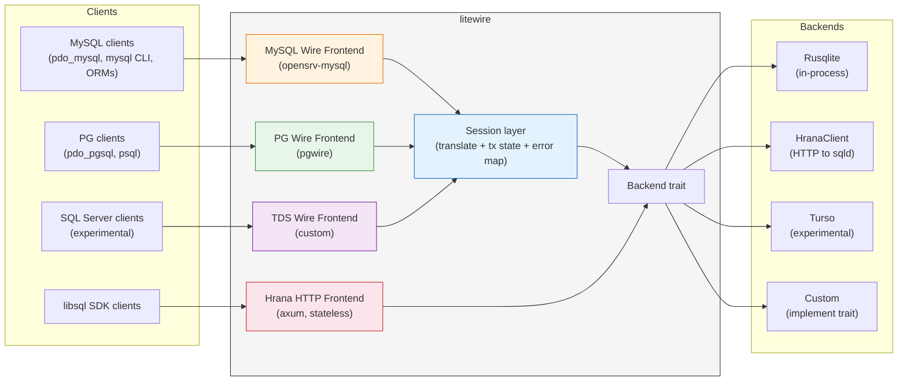

# litewire Architecture

litewire is a protocol translation proxy: it accepts MySQL, PostgreSQL, and TDS
(SQL Server) wire-protocol connections plus Hrana HTTP requests, translates the
SQL dialect to SQLite, executes against a pluggable backend, and returns
results in the original wire format.

Every claim in this document is backed by code in this repository; file paths
are given throughout so it can be checked against the source.

## Overview


```mermaid
graph LR
    subgraph clients["Clients"]
        mysql_client["MySQL clients\n(pdo_mysql, mysql CLI, ORMs)"]
        pg_client["PG clients\n(pdo_pgsql, psql)"]
        tds_client["SQL Server clients\n(experimental)"]
        hrana_client["libsql SDK clients"]
    end

    subgraph litewire["litewire"]
        mysql_fe["MySQL Wire Frontend\n(opensrv-mysql)"]
        pg_fe["PG Wire Frontend\n(pgwire)"]
        tds_fe["TDS Wire Frontend\n(custom)"]
        hrana_fe["Hrana HTTP Frontend\n(axum, stateless)"]
        session["Session layer\n(translate + tx state + error map)"]
        backend_trait["Backend trait"]
    end

    subgraph backends["Backends"]
        rusqlite["Rusqlite\n(in-process)"]
        hrana_be["HranaClient\n(HTTP to sqld)"]
        turso["Turso\n(experimental)"]
        custom["Custom\n(implement trait)"]
    end

    mysql_client --> mysql_fe
    pg_client --> pg_fe
    tds_client --> tds_fe
    hrana_client --> hrana_fe
    mysql_fe --> session
    pg_fe --> session
    tds_fe --> session
    session --> backend_trait
    hrana_fe --> backend_trait
    backend_trait --> rusqlite
    backend_trait --> hrana_be
    backend_trait --> turso
    backend_trait --> custom

    style litewire fill:#f5f5f5,stroke:#333
    style session fill:#e3f2fd,stroke:#1565c0
    style mysql_fe fill:#fff3e0,stroke:#ef6c00
    style pg_fe fill:#e8f5e9,stroke:#388e3c
    style tds_fe fill:#f3e5f5,stroke:#7b1fa2
    style hrana_fe fill:#fce4ec,stroke:#c62828
```

## Crate Structure

The workspace members, as declared in the root `Cargo.toml`:

```
litewire/
├── Cargo.toml                  # workspace root
├── crates/
│   ├── litewire/               # main crate: LiteWire builder + CLI binary
│   │   ├── src/lib.rs          #   builder, feature-gated re-exports
│   │   ├── src/main.rs         #   CLI binary (requires the `cli` feature)
│   │   └── tests/              #   wire-level end-to-end tests (real clients:
│   │                           #   mysql_async, tokio-postgres, tiberius)
│   ├── litewire-backend/       # Backend trait + implementations
│   │   ├── src/lib.rs          #   Backend / BackendConn traits, Value, ResultSet
│   │   ├── src/auth.rs         #   ConnectionAuthenticator (per-connection backends)
│   │   ├── src/conn_limit.rs   #   ConnectionLimiter (max_connections)
│   │   ├── src/rusqlite_backend.rs  # in-process SQLite (feature `rusqlite`)
│   │   ├── src/hrana_client.rs      # remote sqld client (feature `hrana-client`)
│   │   └── src/write_admission.rs   # write admission control (feature `hrana-client`)
│   ├── litewire-translate/     # SQL dialect translation
│   │   ├── src/lib.rs          #   translate(), classify(), no-op/transaction pre-passes
│   │   ├── src/common.rs       #   shared expression rewrites
│   │   ├── src/mysql.rs        #   MySQL rewrites (DDL, upserts, LIKE, REGEXP, ...)
│   │   ├── src/postgres.rs     #   PG type mappings
│   │   ├── src/tds.rs          #   T-SQL rewrites (TOP, IDENTITY, types)
│   │   ├── src/metadata.rs     #   SHOW/DESCRIBE/INFORMATION_SCHEMA/sys.* emulation
│   │   ├── src/found_rows.rs   #   SQL_CALC_FOUND_ROWS / FOUND_ROWS() helpers
│   │   ├── src/cache.rs        #   bounded LRU translate cache
│   │   └── src/emit.rs         #   AST -> SQL string (sqlparser Display)
│   ├── litewire-session/       # dialect-aware session layer
│   │   ├── src/lib.rs          #   Session: translation + tx state + FOUND_ROWS
│   │   └── src/error_map.rs    #   SQLite error text -> MySQL error codes
│   ├── litewire-mysql/         # MySQL wire protocol frontend
│   │   ├── src/lib.rs          #   listener, connection cap, TCP_NODELAY, buffering
│   │   ├── src/handler.rs      #   opensrv-mysql AsyncMysqlShim implementation
│   │   ├── src/command_filter.rs    # screens command packets opensrv mishandles
│   │   ├── src/native_password.rs   # mysql_native_password verify helpers
│   │   └── src/types.rs        #   SQLite affinity -> MySQL column types
│   ├── litewire-postgres/      # PG wire protocol frontend (pgwire)
│   ├── litewire-tds/           # TDS wire protocol frontend (custom, experimental)
│   ├── litewire-hrana/         # Hrana HTTP frontend (stateless subset)
│   └── litewire-turso/         # experimental Turso Database engine backend
└── docs/
    ├── architecture.md         # this file
    └── sql-translation.md      # what SQL is translated, emulated, or rejected
```

## Feature Flags

Features of the `litewire` crate (`crates/litewire/Cargo.toml`):

| Flag | Default | What it enables |
|------|---------|----------------|
| `mysql` | **yes** | MySQL wire protocol frontend |
| `hrana` | **yes** | Hrana HTTP frontend (stateless subset of sqld's API) |
| `backend-rusqlite` | **yes** | In-process SQLite via rusqlite |
| `postgres` | no | PostgreSQL wire protocol frontend |
| `tds` | no | TDS (SQL Server) wire protocol frontend — experimental |
| `backend-hrana-client` | no | Remote sqld via HTTP/Hrana (`HranaClient` backend) |
| `turso` | no | **Experimental** Turso Database engine backend |
| `cli` | no | The `litewire` binary (pulls in clap + tracing-subscriber) |

The binary is gated: `cargo build` without `--features cli` produces no
`litewire` executable (`required-features = ["cli"]` on the `[[bin]]` target).

## Component Design

### Backend Trait

Defined in `crates/litewire-backend/src/lib.rs`. `Backend` is a **factory**:
each wire connection gets its own `BackendConn` session via
`Backend::connect()`, which is what makes transaction state per-client — one
client's `BEGIN` cannot swallow another client's statements.

```rust
#[async_trait]
pub trait Backend: Send + Sync + 'static {
    /// Open a new session. Each BackendConn has its own transaction state.
    async fn connect(&self) -> Result<Box<dyn BackendConn>, BackendError>;

    // Stateless conveniences (fresh throw-away session per call):
    async fn query(&self, sql: &str, params: &[Value]) -> Result<ResultSet, BackendError> { ... }
    async fn execute(&self, sql: &str, params: &[Value]) -> Result<ExecuteResult, BackendError> { ... }
    async fn describe_columns(&self, sql: &str) -> Result<Vec<Column>, BackendError> { ... }
}

#[async_trait]
pub trait BackendConn: Send + Sync {
    async fn query(&self, sql: &str, params: &[Value]) -> Result<ResultSet, BackendError>;
    async fn execute(&self, sql: &str, params: &[Value]) -> Result<ExecuteResult, BackendError>;
    /// Describe a prepared SELECT's columns without executing it.
    /// Default impl falls back to a `LIMIT 0` probe; rusqlite overrides it.
    async fn describe_columns(&self, sql: &str) -> Result<Vec<Column>, BackendError> { ... }
}
```

Three implementations ship:

* **`Rusqlite`** (`rusqlite_backend.rs`, feature `rusqlite`) — in-process
  SQLite. Each session owns a dedicated OS worker thread that owns its
  `rusqlite::Connection` (SQLite calls never run on a tokio worker); WAL mode
  is set once at open, each session sets `busy_timeout` (default 5000 ms) and
  `synchronous=NORMAL`, and statements use `prepare_cached`. `Rusqlite::memory()`
  is backed by a temp file (deleted on drop) so per-connection isolation and
  WAL semantics hold. A `regexp()` scalar function backed by the `regex` crate
  is registered so SQLite's `REGEXP` operator works.
* **`HranaClient`** (`hrana_client.rs`, feature `backend-hrana-client`) —
  forwards to a remote sqld over the Hrana 3 HTTP pipeline protocol. Each
  session pins itself to one sqld stream via the Hrana baton, and a
  write-admission semaphore (`write_admission.rs`) bounds concurrent writes so
  sqld's single-writer lock is queued on this side instead of thrashed.
* **`Turso`** (`crates/litewire-turso`, feature `turso`) — **experimental**
  in-process backend on the Turso Database engine (the Rust rewrite of SQLite,
  Beta upstream, pinned `=0.7.0`). Async-native (no `spawn_blocking`). Known
  unsupported: `VACUUM`, `ATTACH`/`DETACH`, multi-process access to one file,
  byte-exact non-UTF-8 `TEXT` round-trips. It also exposes an experimental CDC
  tail/apply API (`crates/litewire-turso/src/cdc.rs`) for external replication
  layers.

### Session Layer

`crates/litewire-session` — the protocol-independent core of a client
connection, extracted from the MySQL handler so embedders can run SQL
in-process with exactly the wire path's semantics. A `Session` owns one
`BackendConn` and provides:

* dialect translation (via `litewire-translate`, with a shared LRU cache),
* explicit-transaction state tracking (`in_transaction`, reported in MySQL
  status flags),
* `SQL_CALC_FOUND_ROWS` / `SELECT FOUND_ROWS()` emulation — the hint triggers
  a derived `COUNT(*)` round trip; a bare `SELECT FOUND_ROWS()` is answered
  from session state without touching the backend,
* error mapping (`error_map.rs`): SQLite error text → MySQL error triples.
  Mapped codes: 1062 duplicate entry (with a MySQL-shaped message prefix,
  because stock drivers match the text), 1146 no such table (42S02), 1205
  lock wait timeout for `SQLITE_BUSY`, 1290 read-only, 1452 foreign key,
  1064 parse/translate errors, 1105 fallback.

### SQL Translator

`crates/litewire-translate`. `translate(sql, dialect)` runs a fixed pipeline
(see `lib.rs::translate`):

1. **Metadata detection** (before parsing — some inputs are not valid SQL):
   `SHOW ...`, `DESCRIBE`, `INFORMATION_SCHEMA.*`, `SELECT @@vars`,
   `pg_catalog.*`, `sys.tables`/`sys.columns`, `sp_tables`/`sp_columns` are
   answered by emulation queries against `sqlite_master` / `PRAGMA`.
2. **Transaction statement rewrites** (textual): `START TRANSACTION [...]`,
   `BEGIN WORK`, `BEGIN TRANSACTION [name]` → `BEGIN`; `COMMIT`/`ROLLBACK`
   variants normalized; T-SQL savepoint rollbacks mapped to
   `ROLLBACK TO SAVEPOINT`.
3. **No-op detection**: `SET NAMES/CHARACTER SET/time_zone/sql_mode`,
   `SET autocommit` (with a warning for `autocommit=0`, which is *not*
   emulated), `SET [SESSION|GLOBAL] ...`, `SET TRANSACTION ISOLATION LEVEL`,
   T-SQL `SET NOCOUNT/ANSI_NULLS/QUOTED_IDENTIFIER/XACT_ABORT`, and
   `LOCK/UNLOCK TABLES` (warning: SQLite has file-level locking only).
4. **MySQL pre-passes** (quote-aware text transforms for constructs sqlparser
   cannot parse): strip display widths / index prefix lengths from DDL
   (`bigint(20)`, `KEY k (col(191))`), strip SELECT hints
   (`SQL_CALC_FOUND_ROWS`, `SQL_NO_CACHE`, ...).
5. **Parse** with the dialect-matched sqlparser dialect, **rewrite** the AST
   (`common.rs` then the per-dialect module), and **emit** via sqlparser's
   `Display`. MySQL `ALTER TABLE ... ADD KEY/UNIQUE` expands into standalone
   `CREATE INDEX` statements.

`translate_cached` puts a bounded LRU (`cache.rs`) in front of this; the MySQL
frontend shares one cache across all connections. Unparseable SQL returns
`TranslateError::Parse`, surfaced to MySQL clients as `ER_PARSE_ERROR (1064)`.

The full translation reference — every rewrite, every emulated metadata query,
and what is rejected — is in [sql-translation.md](sql-translation.md).

### MySQL Wire Frontend

`crates/litewire-mysql`, built on `opensrv-mysql`. This is the most complete
frontend — it is exercised end-to-end by real-client tests
(`crates/litewire/tests/mysql_e2e.rs` and friends, driven via `mysql_async`)
and has been validated against WordPress and Laravel traffic.

Key implementation details, all in-source:

* **Auth**: with a fixed backend, any username/password is accepted
  (`handler.rs::authenticate` returns `true` when no authenticator is
  installed). With `LiteWire::with_authenticator`, the embedder-supplied
  `ConnectionAuthenticator` decides per connection — see below.
* **Server version**: the handshake, `SELECT VERSION()`, and `@@version` all
  report the single constant `litewire_translate::SERVER_VERSION`
  (`8.0.36-litewire`) so they cannot disagree.
* **Command coverage**: `COM_QUERY`, `COM_STMT_PREPARE`/`EXECUTE`/`CLOSE`,
  `COM_INIT_DB`, `COM_FIELD_LIST`, `COM_PING`, `COM_QUIT` are handled by the
  opensrv shim. A `CommandFilter` (`command_filter.rs`) screens every other
  command byte: `COM_STMT_RESET`, `COM_RESET_CONNECTION`, and
  `COM_CHANGE_USER` are rewritten to the OK-equivalent `COM_PING` (with a
  lazy session reset), and unknown commands are answered with
  `ER_UNKNOWN_COM_ERROR (1047)` instead of the stray OK packet that used to
  desynchronize persistent PHP connections.
* **Connection cap**: `max_connections` refuses over-limit clients immediately
  with a pre-handshake `ER_CON_COUNT_ERROR (1040)` packet; accepts are never
  queued.
* **Latency**: `TCP_NODELAY` on accepted sockets plus a 64 KiB `BufWriter` so
  a whole result set goes out as one write — without both, Nagle + delayed-ACK
  cost ~40 ms per query against PHP's mysqlnd.

### Per-Connection Backends (Multi-Tenant)

`LiteWire::with_authenticator` (see `crates/litewire/src/lib.rs` and
`crates/litewire-backend/src/auth.rs`) builds a server with **no** fixed
backend: a `ConnectionAuthenticator` runs during the MySQL handshake and
returns the backend that connection is bound to, or rejects it. A rejected
connection never has a backend session opened.

This is MySQL-frontend-only by design: `serve()` refuses to start if Hrana,
PostgreSQL, or TDS listeners are also configured under an authenticator,
because those frontends would need one shared backend for every client —
exactly the hole the authenticator exists to close. The security contract
(why the handshake username is a claim, not an identity, and what to key on
instead) is documented on the `auth` module; `native_password.rs` provides
the `mysql_native_password` verification helpers an implementation needs.

### PostgreSQL Wire Frontend

`crates/litewire-postgres`, built on `pgwire`. Implements
`SimpleQueryHandler` and `ExtendedQueryHandler` (`handler.rs`), with a no-op
startup handler — **any credentials are accepted**. Wire-compatible for basic
CRUD with `psql` and the extended-query flow drivers use; exercised by
`crates/litewire/tests/postgres_e2e.rs` via `tokio-postgres`.

### TDS (SQL Server) Wire Frontend — Experimental

`crates/litewire-tds`. No Rust crate implements the server side of TDS
(`tiberius` is client-only), so this is a custom implementation. It handles
Pre-Login, Login7, and SQL Batch messages and answers with
`COLMETADATA`/`ROW`/`DONE` token streams (`handler.rs`, `packet.rs`,
`token.rs`).

Its limitations are real and documented in the README: authentication is
simplified, the encrypted (TLS) handshake is not implemented, and the type
palette is a subset (BigInt / Float8 / NVARCHAR / VarBinary). Real SQL Server
tooling that requires encryption will not connect. Exercised by
`crates/litewire/tests/tds_e2e.rs` via `tiberius` (with encryption off).

### Hrana HTTP Frontend

`crates/litewire-hrana` serves a **stateless subset** of sqld's Hrana HTTP
API — enough for pipelined execute-style access, not a full sqld replacement.

Endpoints (`http.rs::build_router`):

* `POST /v2/pipeline` — Hrana pipeline requests. Supported request types:
  `execute` and `close` only.
* `GET /health` — returns `ok`.
* `GET /version` — returns `litewire/<crate version>`.

Statements are executed through the backend's stateless API; there is **no
baton-based session continuity** — the response's `baton` is always `null`
(`http.rs`: "Stateless for now"), so multi-request interactive transactions
over Hrana are not supported. `batch`/`sequence`/`describe` request types are
not implemented. There is **no authentication** on this frontend. SQL arrives
as SQLite SQL and bypasses the translator entirely.

Because it is stateless HTTP, the Hrana frontend is exempt from
`max_connections` (it opens a throw-away backend session per statement rather
than holding one per connection).

### Result Set Mapping

SQLite result values are dynamically typed. The wire frontends map them using
the column's `decltype` when available (rusqlite exposes it via
`Statement::columns()`; untyped expression columns fall back to typing by
value):

| SQLite affinity | MySQL type | PG type | TDS type |
|----------------|------------|---------|----------|
| `INTEGER` | `MYSQL_TYPE_LONGLONG` | `INT8` | `BigInt` |
| `REAL` | `MYSQL_TYPE_DOUBLE` | `FLOAT8` | `Float8` |
| `TEXT` | `MYSQL_TYPE_VAR_STRING` | `TEXT` | `NVARCHAR` |
| `BLOB` | `MYSQL_TYPE_BLOB` | `BYTEA` | `VarBinary` |
| `NULL` value | null flag in the row (column typed `VAR_STRING` when nothing better is known) | null indicator | null flag |

(Exact mappings: `crates/litewire-mysql/src/types.rs`,
`crates/litewire-postgres/src/types.rs`, `crates/litewire-tds/src/token.rs`.)

## Use as a Library

litewire is designed to be embedded. The builder API
(`crates/litewire/src/lib.rs`):

```rust
use litewire::{LiteWire, backend::Rusqlite};

#[tokio::main]
async fn main() -> anyhow::Result<()> {
    let backend = Rusqlite::open("app.db")?;

    LiteWire::new(backend)
        .mysql("127.0.0.1:3306")
        .hrana("127.0.0.1:8080")
        .max_connections(64)   // per wire frontend; 0 = unlimited (default)
        .serve()
        .await
}
```

Embedders that execute SQL in-process rather than over a socket can use
`litewire::Session` (re-exported from `litewire-session`) directly and get the
same translation, transaction tracking, and error mapping the wire path has.

[ePHPm](https://github.com/ephpm/ephpm) is one such consumer: it embeds
litewire as a library to give PHP applications a MySQL-speaking endpoint
backed by an embedded SQLite-family database. How ePHPm wires litewire into
its deployment modes (single-node, per-site multi-tenant via
`with_authenticator`, clustered replication) is ePHPm's concern and is
documented in that repository — litewire itself is a standalone project with
no ePHPm dependency, and nothing in this repo assumes ePHPm is the embedder.

## Testing Conventions

Wire-level end-to-end tests live in `crates/litewire/tests/` and drive real
client libraries against an in-process server: `mysql_async` (MySQL),
`tokio-postgres` (PG), `tiberius` (TDS). The project's convention is that a
wire-visible bugfix lands with a wire-level regression test reproducing the
client-observed failure (see e.g. `mysql_server_version.rs`,
`mysql_housekeeping.rs`, `mysql_error_codes.rs`, `max_connections.rs`,
`mysql_multi_tenant.rs`). Unit tests live next to the code they cover.

## Prior Art

| Project | Language | What it does |
|---------|----------|-------------|
| **Marmot** | Go | MySQL wire → SQLite, distributed |
| **WP sqlite-database-integration** | PHP | Rewrites MySQL queries to SQLite inside WordPress |
| **Postlite** | Go | PG wire → SQLite (archived) |
| **opensrv-mysql** | Rust | MySQL wire protocol server library (used here) |
| **pgwire** | Rust | PG wire protocol server library (used here) |
